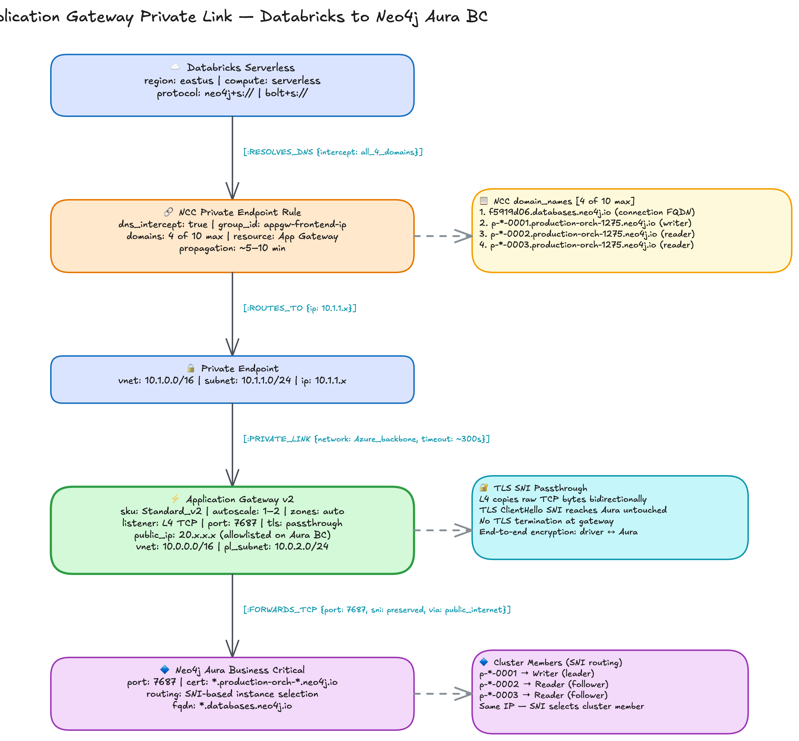

# Application Gateway — Databricks Serverless to Neo4j Aura BC

**Status: Validated** — Full end-to-end connectivity confirmed on 2026-03-20, including `neo4j+s://` with routing table discovery and client-side read/write splitting across cluster members. See [ARCHITECTURE.md](ARCHITECTURE.md) for the complete technical explanation.

## Architecture Overview



## How It Works

This architecture connects Databricks serverless compute to Neo4j Aura Business Critical over Azure Private Link using Application Gateway v2 as an L4 TCP proxy. It is fully managed: no VMs, no HAProxy, no NAT Gateway, no Load Balancer.

Two mechanisms make this the ideal solution for private Databricks-to-Aura-BC connectivity.

**L4 TCP passthrough preserves TLS SNI end-to-end.** The Application Gateway operates at Layer 4, forwarding raw TCP bytes on port 7687 without terminating or inspecting TLS. When the Neo4j driver initiates a connection, it sends the Aura BC hostname as the Server Name Indication (SNI) value in the TLS ClientHello. That SNI passes through the entire chain untouched: from Databricks through the Private Link tunnel, through the Application Gateway, and out to Aura's shared ingress endpoint. Aura BC serves many database instances behind a single IP address and relies on SNI to route each connection to the correct instance. Any intermediary that strips or changes the SNI causes Aura to reject the connection. L4 TCP passthrough eliminates this risk because the gateway never sees the TLS payload.

**NCC multi-domain private endpoint rules enable full `neo4j+s://` protocol support.** The `neo4j+s://` protocol triggers routing table discovery: after the initial connection, the driver asks the server for a list of cluster member hostnames and opens separate connections to each. These routing table hostnames (in the `*.production-orch-*.neo4j.io` domain) differ entirely from the connection FQDN (`*.databases.neo4j.io`). Without all hostnames in the NCC private endpoint rule, Databricks resolves them via public DNS and bypasses the Private Link tunnel. The solution is a single PE rule with all domains in its `domain_names` array (the connection FQDN plus the three routing table member hostnames, four total, well within the 10-domain limit). NCC intercepts DNS for every listed domain and routes all connections through the private endpoint. One API call, zero infrastructure changes.

These two mechanisms together deliver the full Neo4j driver protocol stack over Private Link: TLS encryption end-to-end, SNI-based instance routing at Aura's edge, and client-side routing with automatic read/write splitting across cluster members.

```
Databricks Serverless (eastus)
    |
    |  NCC Private Endpoint (multi-domain: connection FQDN + routing table members)
    v
Private Link tunnel (Azure backbone)
    |
    v
Application Gateway v2 (L4 TCP listener, port 7687, TLS passthrough)
    |
    |  Outbound via gateway public IP (allowlisted on Aura BC)
    v
Neo4j Aura Business Critical (*.databases.neo4j.io:7687)
```

## Quick Start

```bash
# 1. Configure credentials
cp .env.sample .env
# Edit .env: NEO4J_URI, NEO4J_USERNAME, NEO4J_PASSWORD,
#            AURA_API_CLIENT_ID, AURA_API_CLIENT_SECRET,
#            AURA_ORG_ID, AURA_INSTANCE_ID,
#            DATABRICKS_ACCOUNT_ID, DATABRICKS_WORKSPACE_ID,
#            NEO4J_DOMAIN (bare FQDN, no scheme)

# 2. Deploy App Gateway (phased — see "Why Phased Deployment" below)
#    Phase 1: Pure L7 gateway + Private Link + Private Endpoint (~8 min)
#    Phase 2: Add L4 TCP listener for Bolt traffic (~8 min)
uv run python setup_azure.py phase1
uv run python setup_azure.py phase2

# 3. Check status
uv run python setup_azure.py status

# 4. Create Databricks NCC and private endpoint rule (includes routing table domains)
uv run python deploy.py create-ncc --profile <databricks-cli-profile>
uv run python deploy.py create-pe-rule --profile <databricks-cli-profile>

# 5. Approve the pending private endpoint connection
uv run python deploy.py approve

# 6. Attach NCC to workspace (wait ~10 min for propagation)
uv run python deploy.py attach-ncc --profile <databricks-cli-profile>

# 7. Check NCC status (PE rule should be ESTABLISHED)
uv run python deploy.py ncc-status --profile <databricks-cli-profile>

# 8. Store Neo4j credentials and domain in Databricks secrets
uv run python deploy.py setup-secrets --profile <databricks-cli-profile>

# 9. Test from a Databricks serverless notebook
#    Import appgw_private_link_test.ipynb into your workspace
#    and run on serverless compute. Domain and password are read from secrets.
```

## Test from Databricks

After attaching the NCC and storing secrets, import `appgw_private_link_test.ipynb` into your Databricks workspace and run it on serverless compute. The notebook reads both the Neo4j domain and password from the `neo4j-appgw-poc` secret scope (populated by `deploy.py setup-secrets`). No manual edits needed.

The notebook runs three tests:

1. **TCP connectivity** — verifies the Private Link path is open on port 7687
2. **Neo4j driver (bolt+s://)** — connects with `bolt+s://`, authenticates, and runs a test query
3. **Neo4j driver (neo4j+s://)** — connects with `neo4j+s://`, inspects the routing table, and validates read/write distribution across cluster members. Routing table domains are included automatically by `deploy.py create-pe-rule`

## Why Phased Deployment

Application Gateway v2's Private Link feature validates against `httpListeners` only. L4 TCP listeners are invisible to this validation. If you deploy both L7 and L4 listeners simultaneously, Private Endpoint creation fails with:

```
ApplicationGatewayPrivateLinkOperationError:
Cannot perform private link operation on ApplicationGateway ...
Please make sure application gateway has private link configuration.
```

The error is misleading — the Private Link configuration exists and is correctly bound. The problem is that PL validation only runs at PE creation time and only inspects L7 listeners.

The workaround: deploy in two phases.

1. **Phase 1** deploys a pure L7 gateway (HTTP listener on port 80, no L4 properties). Private Link validation passes. A Private Endpoint is created and approved.
2. **Phase 2** updates the same gateway to add L4 TCP listeners on port 7687. The Private Link tunnel, already established, continues to forward traffic. Azure does not re-validate the PL configuration on gateway updates.

This was validated on 2026-03-20.

## Prerequisites

- Azure CLI (`az`) logged in with a subscription
- [uv](https://docs.astral.sh/uv/) for Python dependency management
- Databricks CLI (for NCC and secrets commands)
- A Neo4j Aura Business Critical instance
- Aura Admin API credentials (client ID + secret)

## Validate Locally

Before setting up the Databricks Private Link path, validate direct connectivity to Aura BC:

```bash
uv run python validate_bolt.py
```

Tests `neo4j+s://`, `bolt+s://`, and both schemes with Private Link keepalive settings.

## Key Constraints

| Constraint | Detail |
|------------|--------|
| `neo4j+s://` requires routing table domains | `neo4j+s://` triggers routing table discovery, returning cluster member hostnames that must be in the NCC PE rule. `create-pe-rule` includes them automatically. If hostnames drift, run `deploy.py update-pe-domains` to resync. |
| Real Aura FQDN as NCC domain | Databricks uses the PE rule domain as the TLS SNI hostname. Aura BC rejects unrecognized SNI. The NCC PE rule domain must be the actual Aura FQDN (e.g. `f5919d06.databases.neo4j.io`). |
| ~300s idle timeout | App Gateway Private Link has a ~5 minute idle timeout. Set `max_connection_lifetime` and `liveness_check_timeout` below 300 in the Neo4j driver. |
| NCC region matches workspace | The NCC must be in the same region as the Databricks workspace. The App Gateway can be in the same or a different region. |
| Phased deployment required | L4 listeners must be added after PE creation (see above). Do not deploy L4 and create the PE in a single step. |

## Architecture

The App Gateway sits between the Databricks private endpoint and Aura BC on the public internet:

```
Databricks Serverless
    |
    |  NCC Private Endpoint (10.1.1.x)
    v
Private Link tunnel
    |
    v
App Gateway v2 Frontend IP (public: 20.x.x.x, PL config: pl-config)
    |
    |  L4 TCP listener, port 7687 (TLS passthrough)
    v
App Gateway v2 Backend Pool (aura FQDN)
    |
    |  Outbound TCP (public IP allowlisted on Aura BC)
    v
Neo4j Aura BC (*.databases.neo4j.io:7687)
```

Key properties:
- No proxy VMs, NAT Gateway, Load Balancer, or HAProxy
- Application Gateway originates its own outbound connections via its public IP
- Two subnets: App Gateway subnet (with delegation) and Private Link subnet
- A separate PE VNet with a PE subnet (for the Private Endpoint)
- L4 TCP passthrough preserves TLS SNI end-to-end (the gateway never terminates TLS)

## Scripts

### setup_azure.py — Azure infrastructure

| Command | Description |
|---------|-------------|
| `phase1` | Deploy pure L7 gateway + Private Link + Private Endpoint |
| `phase2` | Update gateway to add L4 TCP listeners |
| `status` | Show App Gateway, PE, and Private Link state |
| `cleanup` | Delete the resource group and all resources |

### deploy.py — Databricks NCC integration

| Command | Description |
|---------|-------------|
| `status` | Show App Gateway health, backend status, Private Link connections |
| `cleanup` | Delete the resource group and all resources |
| `create-ncc` | Create a Databricks NCC |
| `create-pe-rule` | Create PE rule with connection FQDN + routing table domains |
| `approve` | Approve pending private endpoint connections |
| `attach-ncc` | Attach NCC to a Databricks workspace |
| `setup-secrets` | Store Neo4j credentials and domain in Databricks secrets |
| `ncc-status` | Show NCC, PE rule state, and workspace attachment |
| `update-pe-domains` | Sync PE rule domains with current routing table (maintenance) |
| `detach-ncc` | Detach and delete NCC from Databricks |

### Other scripts

| Script | Purpose |
|--------|---------|
| `validate_bolt.py` | Test bolt+s:// and neo4j+s:// connectivity |
| `manage_ip_allowlist.py` | Manage Aura BC IP allowlist entries |
| `routing_poc/inspect_routing_table.py` | Inspect Neo4j routing table hostnames from Aura BC |
| `appgw_private_link_test.ipynb` | Databricks notebook for end-to-end Private Link validation |

## Bicep Templates

| File | Purpose |
|------|---------|
| `infra/main-phase1.bicep` | Pure L7 App Gateway + Private Link (no L4 properties) |
| `infra/main-phase2.bicep` | L7 + L4 App Gateway (adds TCP listener on port 7687) |
| `py-test/infra/main.bicep` | Test VM + Private Endpoint for end-to-end validation |

## Project Files

```
app-gateway-pl/
  infra/
    main-phase1.bicep       # Phase 1: pure L7 gateway + Private Link
    main-phase2.bicep       # Phase 2: adds L4 TCP listener
  setup_azure.py            # Phased Azure deployment (phase1/phase2/status/cleanup)
  deploy.py                 # Databricks NCC integration
  validate_bolt.py          # Direct bolt+s:// validation
  manage_ip_allowlist.py    # Aura BC IP allowlist management
  azure-resources.json      # Generated resource manifest (gitignored)
  appgw_private_link_test.ipynb  # Databricks notebook for Private Link validation
  routing_poc/
    inspect_routing_table.py  # Neo4j routing table inspection
  py-test/
    infra/main.bicep        # Test VM + Private Endpoint Bicep
    deploy_test_vm.py       # VM deployment orchestrator
    conftest.py             # pytest fixtures
    test_appgw_connectivity.py  # End-to-end connectivity tests
```

## References

| Topic | URL |
|-------|-----|
| App Gateway TCP/TLS proxy overview | https://learn.microsoft.com/azure/application-gateway/tcp-tls-proxy-overview |
| App Gateway Private Link | https://learn.microsoft.com/azure/application-gateway/private-link |
| App Gateway Private Link config | https://learn.microsoft.com/azure/application-gateway/private-link-configure |
| App Gateway FAQ (L4 + L7 same frontend IP) | https://learn.microsoft.com/en-us/azure/application-gateway/application-gateway-faq |
| MS Q&A: PE creation steps and group-id | https://learn.microsoft.com/en-us/answers/questions/2099854/azure-cli-cannot-create-private-endpoint-for-appli |
| Databricks: Private connectivity to VNet resources | https://learn.microsoft.com/en-us/azure/databricks/security/network/serverless-network-security/pl-to-internal-network |
| Databricks: Manage PE rules (supported resources) | https://learn.microsoft.com/en-us/azure/databricks/security/network/serverless-network-security/manage-private-endpoint-rules |
| Databricks: Serverless private link | https://learn.microsoft.com/en-us/azure/databricks/security/network/serverless-network-security/serverless-private-link |
| Azure Private Link Service overview | https://learn.microsoft.com/azure/private-link/private-link-service-overview |

## Cleanup

```bash
# Remove Azure resources
uv run python setup_azure.py cleanup

# Remove the App Gateway IP from Aura BC allowlist
uv run python manage_ip_allowlist.py list
uv run python manage_ip_allowlist.py remove --filter-id <ID>

# Detach and delete NCC (if created)
uv run python deploy.py detach-ncc --profile <databricks-cli-profile>
```
