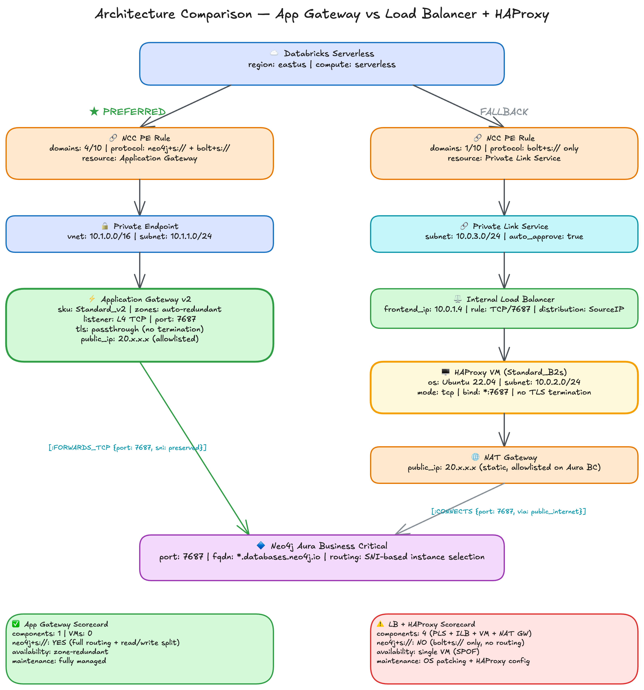

# Alternatives Evaluated

Several approaches were investigated before arriving at the Application Gateway architecture. Each is documented here with the reason it was set aside.

## Architecture Comparison

## Load Balancer with HAProxy Reverse Proxy

**Status:** Works, but not preferred.

This approach deploys an Internal Load Balancer fronted by a Private Link Service, with an HAProxy VM forwarding Bolt traffic to Aura BC via a NAT Gateway. It was validated end-to-end with `bolt+s://`.

The Application Gateway approach is preferred because it eliminates the reverse proxy entirely. The LB architecture requires four components (ILB, PLS, HAProxy VM, NAT Gateway) where the Application Gateway requires one managed resource. The VM introduces a single point of failure, ongoing patching and monitoring requirements, and kernel-level packet forwarding overhead. The NAT Gateway adds cost for a static outbound IP. The Application Gateway provides load balancing, traffic forwarding, and a static outbound IP natively. Traffic traverses fewer network hops, which yields lower end-to-end latency.

The LB architecture remains a valid fallback if the Application Gateway phased deployment is incompatible with a customer's change management process. The NCC multi-domain PE rule should work identically with either architecture since NCC sits in front of both, though it has only been validated on the Application Gateway path.

## Dual Load Balancers Splitting by Port

**Status:** Not viable.

This approach proposed splitting Bolt traffic (port 7687) and HTTP API traffic (port 7473) across two separate load balancers. The reasoning was that `neo4j+s://` routing table discovery used the HTTP API on a separate port. Investigation revealed that the routing table is fetched over the Bolt protocol on port 7687, not the HTTP API. Port 7473 is not involved in `neo4j+s://` routing behavior. Two load balancers carrying the same port to the same destination would add cost and complexity without solving the hostname resolution problem.

## SNI-Based Reverse Proxy Port Routing

**Status:** Not viable.

This approach proposed using HAProxy's SNI inspection to route traffic between Bolt and HTTP ports based on the TLS hostname. It was based on the same incorrect assumption as the dual load balancer approach: that routing table discovery required the HTTP API on port 7473. Since the ROUTE message is a Bolt protocol message on port 7687, SNI-based port routing was addressing a non-existent problem.

## Self-Hosted Reverse Proxy Pattern Applied to Managed Service

**Status:** Not transferable.

A demonstration with a self-hosted Neo4j cluster showed `neo4j+s://` working through an HAProxy reverse proxy with round-robin backend routing. That setup worked because the operator controlled all hostnames, DNS records, and certificates, and could configure HAProxy backends to match the routing table entries.

Aura BC is a managed service. The routing table returns hostnames in a domain the customer does not control (`*.production-orch-*.neo4j.io`), and these hostnames differ from the connection FQDN (`*.databases.neo4j.io`). The proxy mechanism works identically in TCP passthrough mode, but the DNS and hostname control that made the self-hosted pattern viable does not exist with a managed service. The NCC multi-domain PE rule solves this at the network layer instead.

## Direct Databricks Serverless IP Allowlisting

**Status:** Not viable without preview feature access.

Databricks serverless compute does not expose stable outbound IP addresses. The IP pool changes as compute scales. A serverless compute firewall preview feature exists that would provide the actual outbound IP list for allowlisting on Aura BC, eliminating the need for Private Link entirely. Access to this feature has not been granted.

## NCC Wildcard Domain Rules

**Status:** Not supported by NCC.

NCC does not support wildcard patterns in PE rule domain names. Only exact FQDNs are accepted. A wildcard rule like `*.production-orch-*.neo4j.io` would have matched all routing table hostnames with a single entry, but the NCC API rejects non-FQDN values. The multi-domain PE rule (explicit listing of all FQDNs) is the working alternative.

## Neo4j Driver Custom Resolver

**Status:** Insufficient coverage.

The Neo4j driver offers a custom resolver interface that can override hostname resolution. Investigation revealed that no driver implementation intercepts the full connection lifecycle:

- The Java driver resolver only intercepts the initial seed address. Routing table addresses bypass the resolver entirely.
- The Python driver resolver intercepts routing table router contacts but not reader/writer query connections.
- The Spark connector exposes no custom resolver interface.

Even in the best case, the resolver cannot control the network path for actual query traffic to cluster members. The NCC multi-domain approach solves DNS interception at the network layer, making driver-level resolution unnecessary.
